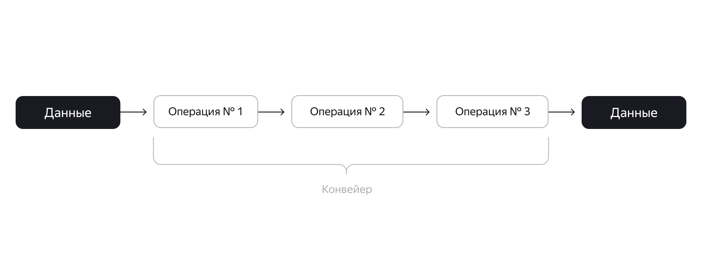

# Почему Apache Airflow стал незаменимым инструментом для работы с данными
# Почему Apache Airflow стал незаменимым инструментом для работы с данными

Обычно работа с автоматизацией процессов обработки информации начинается с ручного управления задачами. Например, в машинном обучении это может включать подготовку наборов данных, обучение моделей, анализ результатов и развертывание решений в рабочей среде. По мере роста команды и развития продукта эти процессы усложняются: увеличивается количество повторяющихся операций, появляются зависимости между задачами, и каждая из них приобретает всё большее значение для бизнеса. В результате формируется полноценный конвейер задач, требующий регулярного запуска.

Аналогичная ситуация возникает при обработке данных: в определенный момент необходимо собрать актуальную информацию, преобразовать её и выполнить различные операции — создать витрину данных и сохранить в базу, обучить модель машинного обучения, подготовить отчет в Excel и разослать его по электронной почте. Вариантов множество, и для решения таких задач требуются специализированные инструменты.

Одним из таких решений является Apache Airflow. Благодаря поддержке сообщества разработчиков он стал стандартом де-факто в своей области.

В сфере работы с данными Airflow часто называют инструментом для пакетной обработки данных в рамках подхода ETL (Extract, Transform, Load). Однако важно понимать, что Airflow не является классической ETL-системой, а скорее помогает организовывать весь процесс извлечения, преобразования и загрузки данных через Python-скрипты.

Наиболее точное определение Airflow — это оркестратор рабочих процессов. Задачи и их зависимости описываются в скриптах на Python, а Airflow отвечает за планирование и выполнение кода на основе заданных конфигураций.

# Преимущества использования Apache Airflow

Вот ключевые причины, по которым стоит выбрать Airflow:

- **Открытый исходный код**. Изначально разработанный как внутренний проект Airbnb, Airflow нуждался в активном сообществе для своего развития. Именно поэтому он был выпущен как open-source решение. Сегодня Airflow поддерживается и управляется как один из флагманских проектов Apache Software Foundation.

💡 В дальнейших материалах вы можете встретить как "Apache Airflow", так и просто "Airflow" — речь идет об одном и том же инструменте с открытым исходным кодом, разрабатываемом под эгидой Apache.

- **Интуитивный веб-интерфейс**. Пользовательский интерфейс позволяет легко отслеживать все рабочие процессы, изменять их параметры, запускать или останавливать выполнение. Хотя работа возможна и через командную строку, веб-интерфейс значительно понижает порог входа в технологию, делая Airflow доступным не только для инженеров данных, но и для аналитиков, разработчиков, системных администраторов и DevOps-специалистов.

- **Основан на Python**. Вся конфигурация создается с использованием языка Python, включая настройку расписаний и скриптов для выполнения задач. Это позволяет использовать привычные Python-библиотеки и классы для создания рабочих процессов, избавляя от необходимости работать с JSON или XML конфигурационными файлами. Кроме того, Python является стандартом де-факто для специалистов в области Big Data и Data Science.

- **Широкое распространение**. Airflow активно используется такими компаниями, как Airbnb, Intel, PayPal, WePay и Yahoo!, став незаменимым инструментом в арсенале инженера данных. Опыт работы с Airflow часто указывается как требование в вакансиях на позицию Data Engineer.

- **Простота внедрения**. Легкая установка, быстрый старт, удобная визуализация, возможность автоматического создания большого количества задач и широкие возможности кастомизации.

- **Масштабируемость**. Модульная архитектура и поддержка очередей сообщений (Celery/Dask) позволяют работать с неограниченным количеством DAG.

- **Встроенный репозиторий метаданных**. На базе библиотеки SQLAlchemy хранятся состояния задач, DAG, глобальные переменные и другая служебная информация.

- **Богатая экосистема интеграций**. Поддержка различных баз данных (MySQL, PostgreSQL, DynamoDB, Hive), хранилищ Big Data (HDFS, Amazon S3) и облачных платформ (Google Cloud Platform, Amazon Web Services, Microsoft Azure).

- **Расширяемый REST API**. Возможность легко интегрировать Airflow в существующую IT-инфраструктуру и гибко настраивать конвейеры данных, например, передавая параметры в DAG через HTTP-запросы.

# Когда Airflow может не подойти

Существуют сценарии, для которых этот инструмент не является оптимальным выбором:

- **Потоковая обработка данных**. Airflow изначально разработан для выполнения повторяющихся пакетных задач, а не для обработки потоковых данных, где события могут быть распределены во времени. В таких случаях лучше рассмотреть специализированные решения.

- **Требования к знанию Python**. Поскольку Airflow полностью основан на Python, работа с ним предполагает хорошее владение этим языком программирования. Специалисты, знакомые только с SQL или другими языками, могут испытывать трудности. В таких ситуациях можно рассмотреть решения с минимальным количеством кода и упором на графический интерфейс (например, Azure Data Factory) или упростить задачу до статического процесса с запуском по расписанию.

- **Сложность поддержки чистоты кода**. При работе с конвейерами обработки данных (представленными в Airflow как DAG), код может быстро усложниться и стать непонятным для других разработчиков. Поэтому успешная работа с Airflow требует от инженеров данных хорошего владения Python и соблюдения принципов проектирования, таких как KISS, правильного именования переменных и написания документации.

Если ваш сценарий не включает потоковую обработку данных (например, анализ событий в мобильном приложении) и вы не испытываете сложностей с Python, то Airflow, скорее всего, станет отличным выбором, а его базовый функционал покроет большинство ваших потребностей.

# Практическое применение Airflow

На практике Apache Airflow используется в следующих сценариях:

- Интеграция данных из множества информационных систем (внутренние и внешние базы данных, файловые хранилища, облачные приложения и т.д.)
- Загрузка информации в корпоративное озеро данных (Data Lake)
- Создание уникальных конвейеров доставки и обработки больших объемов данных (data pipeline)
- Управление конфигурацией конвейеров данных как кодом в соответствии с DevOps-подходом
- Автоматизация разработки, планирования и мониторинга пакетных процессов обработки данных

💡 Пакетная обработка данных (batch processing) подразумевает обработку информации крупными порциями, где у каждой задачи есть четко определенное начало и конец.

# Как компании развертывают Airflow

В российских компаниях Airflow часто развертывается на собственных серверах силами DevOps-инженеров или системных администраторов. Это связано с требованиями законодательства о хранении и обработке пользовательских данных на территории РФ. Такой подход называют on-premise (или on-prem), что означает развертывание и администрирование инструмента собственными силами на арендованных или приобретенных мощностях в дата-центрах.

Одновременно с этим крупные облачные провайдеры предлагают Airflow в виде управляемого сервиса:

- **Astronomer** создал SaaS-платформу вокруг Airflow с расширенными возможностями мониторинга, оповещения об инцидентах и DevOps-инструментами, развертываемыми на кластерах Kubernetes.
- **Cloud Composer** — управляемый облачный сервис Airflow от Google Cloud Platform (GCP), тесно интегрированный с другими сервисами GCP.
- **Amazon Managed Workflows for Apache Airflow (MWAA)** — аналогичное решение от Amazon Web Services (AWS).

Такой "облачный" подход часто предоставляется как managed-сервис, что означает отсутствие необходимости заботиться о развертывании и администрировании — этим занимается провайдер. Однако у такого подхода есть и недостатки, в первую очередь высокая стоимость при больших объемах данных или интенсивном использовании.

Облачное развертывание Airflow преимущественно распространено в зарубежных компаниях и стартапах.

В этом материале вы познакомились с предпосылками появления инструментов управления процессами, подобных Airflow. Вы узнали, в каких сценариях Airflow наиболее эффективен, а в каких случаях стоит рассмотреть альтернативные решения, а также как этот инструмент применяется на практике в крупных российских и международных компаниях.

💡 Обратите внимание, что в данном модуле рассматривается Airflow версии 2.5.