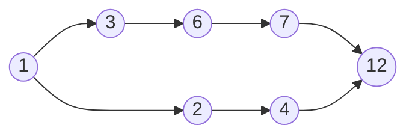
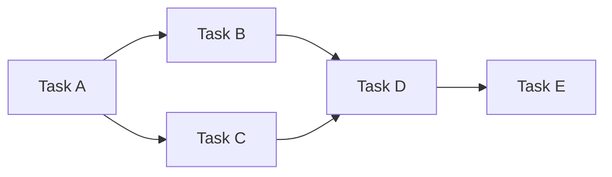
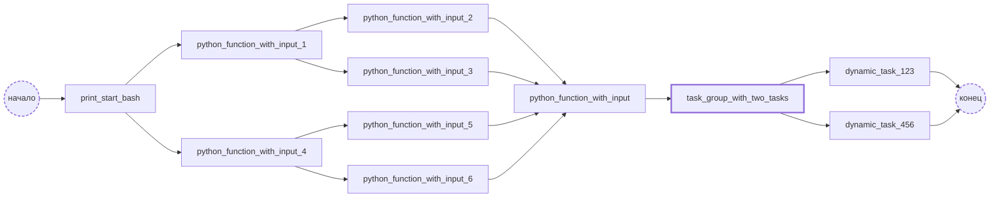
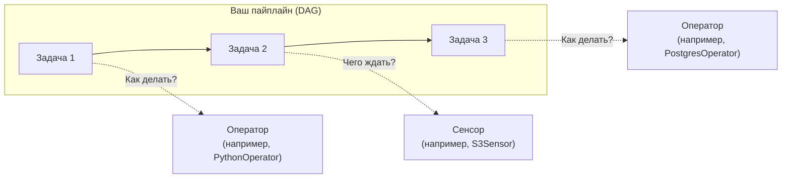

# Понятное введение в ключевые понятия Airflow

В этом материале мы разберем фундаментальные концепции Apache Airflow, которые вам обязательно понадобятся при создании пайплайнов обработки данных. Знание этих базовых терминов и компонентов поможет вам эффективно работать с системой.

# **Что такое DAG и почему он важен**

Сердце Apache Airflow — это DAG (Directed Acyclic Graph), что переводится как "направленный ациклический граф". Давайте разберем это сложное название по частям:

- **Граф** — это структура, где элементы (узлы) связаны между собой стрелками (ребрами)
- **Направленный** — означает, что связи имеют четкое направление: от одного элемента к другому, как последовательные этапы в обработке данных
- **Ациклический** — гарантирует, что вы не можете вернуться к уже пройденному узлу, избегая бесконечных циклов

Проще говоря, DAG — это упорядоченный набор задач, которые выполняются строго по расписанию и никогда не повторяются в рамках одного запуска. Создавая пайплайны для обработки данных, вы фактически создаете DAG.



# Шаги вашего пайплайна: Задачи

Задачи — это отдельные шаги в вашем процессе обработки данных. Каждая задача представляет собой конкретную бизнес-операцию:
- Проверка наличия файла в хранилище
- Выполнение SQL-запроса
- Запуск Python-функции с бизнес-логикой
- Отправка уведомления

💡 **Совет по проектированию**: Разбивайте сложные процессы на мелкие, атомарные задачи. Такой подход делает пайплайн более гибким, упрощает тестирование и помогает быстрее находить и исправлять ошибки.

На примере ниже видно, как задача E зависит от успешного завершения всех предыдущих задач:



Airflow позволяет создавать сложные сценарии:
- Зависимости между разными DAG-ами с помощью TriggerDagRunOperator и ExternalTaskSensor
- Условное выполнение задач в зависимости от результатов предыдущих шагов
- Сложные ветвления и параллельные ветки выполнения



# Инструменты для выполнения: Операторы

Операторы — это готовые шаблоны, которые определяют, КАК выполнять ваши задачи. Думайте о них как о строительных блоках для вашего пайплайна.

Пример простого DAG с двумя задачами:

В этом примере создается DAG с идентификатором 'greeting_dag', который запускается каждые 10 минут. DAG включает в себя две задачи: 'start_process' (использует DummyOperator как точку старта) и 'greeting_task' (использует PythonOperator для выполнения функции приветствия).

```python
from airflow import DAG
from airflow.operators.dummy import DummyOperator
from airflow.operators.python import PythonOperator
from datetime import datetime

def greet_user():
    print('Welcome to Airflow!')

dag = DAG('greeting_dag',
           description='Simple Greeting DAG',
           schedule_interval='*/10 * * * *',
           start_date=datetime(2023, 1, 1),
           catchup=False)

start_task = DummyOperator(task_id='start_process', retries=2)
greeting_task = PythonOperator(task_id='greeting_task', python_callable=greet_user)

start_task >> greeting_task
```

В этом примере задача `greeting_task` использует `PythonOperator` для запуска функции `greet_user`, которая выводит приветственное сообщение в логи.

Airflow предоставляет множество готовых операторов:
- **PythonOperator** — выполнение Python-кода
- **BashOperator** — запуск команд и скриптов в терминале
- **PostgresOperator** — выполнение SQL-запросов (аналоги есть для MySQL, Oracle, Hive)
- **EmailOperator** — отправка электронных писем
- **DummyOperator** — "заглушка" для организации структуры пайплайна

💡 **Важное различие**: Задача определяет ЧТО нужно сделать (бизнес-логика), а оператор — КАК это сделать (техническая реализация).

# Ожидание событий: Сенсоры

Сенсоры — это специальный тип операторов, предназначенный для ожидания определенных условий или событий. Они идеально подходят для событийно-ориентированных пайплайнов.

Популярные сенсоры включают:
- **PythonSensor** — ожидает, пока функция не вернет `True`
- **S3Sensor** — проверяет наличие файла в S3-бакете
- **RedisPubSubSensor** — ждет поступления сообщения в очередь
- **RedisKeySensor** — проверяет существование ключа в Redis

Airflow поддерживает расширение функциональности через providers и позволяет создавать собственные операторы и сенсоры под специфические нужды.

# Краткое резюме

Давайте закрепим ключевые понятия:

- **DAG** — ваш пайплайн обработки данных, объединяющий задачи в логическую последовательность
- **Задача** — отдельный шаг в пайплайне, представляющий конкретную бизнес-операцию
- **Оператор** — технический инструмент для выполнения задачи (Python, SQL, Bash и т.д.)
- **Сенсор** — специальный оператор для ожидания внешних событий или условий

Взаимосвязь этих компонентов можно представить так:

