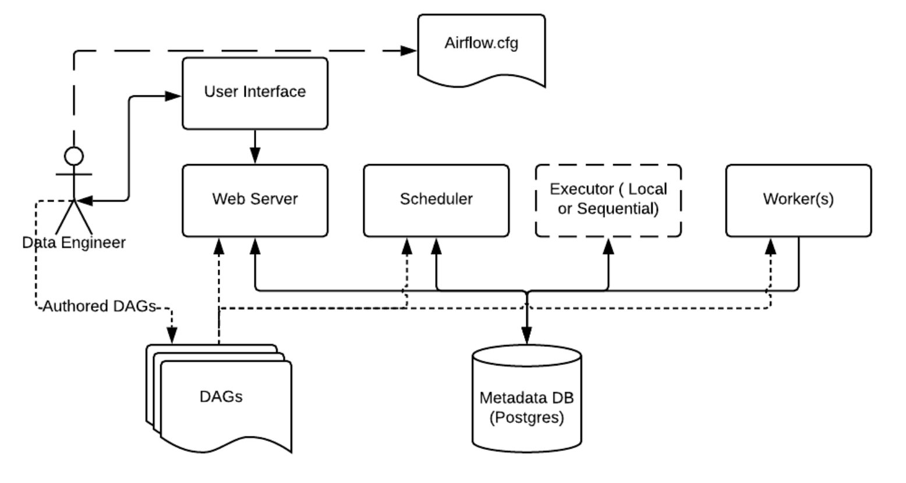

# Как устроен Airflow внутри

В этом уроке мы разберём, как устроен Apache Airflow изнутри. Вы узнаете, из каких компонентов состоит эта система и как они взаимодействуют между собой для выполнения задач по обработке данных. В конце мы проследим полный путь выполнения задачи от начала до конца.

## Основные компоненты Airflow

Apache Airflow состоит из нескольких взаимосвязанных компонентов, которые совместно обеспечивают выполнение задач, отслеживание их статусов, перезапуск при ошибках и логирование операций.

На схеме ниже показано, как эти компоненты взаимодействуют между собой:

*Как устроена система Airflow*

Давайте подробно рассмотрим каждый компонент системы.

### Файлы DAG
Это Python-файлы, в которых инженеры данных описывают последовательности операций по обработке данных. Все эти файлы хранятся в специальной директории, которую Airflow постоянно отслеживает на наличие изменений.

### Конфигурационный файл (airflow.cfg)
Главный файл настроек Airflow, где задаются все параметры работы системы: частота проверки расписаний, пути к файлам, настройки подключения к базе данных и многое другое. Практически все компоненты Airflow обращаются к этому файлу для получения необходимых параметров.

### База данных метаданных
Это хранилище служебной информации о работе системы: статусы задач, время их запуска и завершения, зависимости между задачами и другая техническая информация. В качестве базы данных обычно используют PostgreSQL или MySQL.

### Веб-интерфейс (Web Server)
Графический интерфейс, с которым взаимодействуют пользователи Airflow. Он позволяет визуализировать DAG-и, отслеживать статусы задач, просматривать логи и управлять выполнением пайплайнов. Веб-интерфейс построен на Python с использованием фреймворка Flask.

### Планировщик (Scheduler)
Центральный компонент Airflow, который отвечает за координацию всех процессов. Планировщик отслеживает расписания запуска DAG-ов, определяет, какие задачи нужно выполнять, и управляет их статусами.

### Исполнитель (Executor)
Компонент, который работает в тесной связке с планировщиком и определяет, как и где будут выполняться задачи. В зависимости от инфраструктуры можно использовать разные типы исполнителей: LocalExecutor (для локального выполнения), CeleryExecutor, KubernetesExecutor и другие.

### Рабочие процессы (Workers)
Это "исполнители" задач, которые фактически выполняют код задач. Рабочие процессы сообщают о своём статусе планировщику и исполнителю. В распределённых системах рабочие процессы могут работать на отдельных серверах для повышения надёжности и производительности.

## Как всё работает вместе

Теперь давайте проследим, как происходит выполнение задачи в Airflow от начала до конца.

Представим, что инженер данных создал DAG с ежедневным расписанием на 12 часов дня и поместил файл в директорию DAG-ов.

1. Планировщик постоянно проверяет текущее время и сравнивает его с расписаниями всех DAG-ов.

2. В 12 часов планировщик обнаруживает, что настало время запустить наш DAG. Он считывает файл DAG, анализирует зависимости между задачами и определяет порядок их выполнения.

3. Информация о задачах и их начальных статусах записывается в базу данных метаданных.

4. Планировщик обращается к исполнителю, указанному в конфигурационном файле, чтобы тот выделил ресурсы для выполнения задач.

5. Исполнитель запускает рабочие процессы для выполнения задач. В случае LocalExecutor задачи выполняются как локальные подпроцессы, а при использовании других исполнителей — на удалённых рабочих узлах.

6. По мере выполнения задач рабочие процессы обновляют их статусы в базе данных метаданных, что позволяет планировщику отслеживать прогресс и запускать следующие задачи в зависимости от успешности предыдущих.

Таким образом, Airflow обеспечивает надёжное и контролируемое выполнение сложных пайплайнов обработки данных благодаря чёткому разделению ответственности между компонентами системы.

Для более глубокого изучения основных концепций Airflow рекомендуем обратиться к [официальной документации](https://airflow.apache.org/docs/apache-airflow/stable/concepts/overview.html).

В этом уроке вы узнали, как устроена система Airflow изнутри, познакомились с её ключевыми компонентами и поняли, как они взаимодействуют для выполнения задач по обработке данных.