# Знакомство с интерфейсом Airflow для начинающих

Когда вы создаете ETL-процессы для автоматической обработки данных, важно иметь удобный способ отслеживать их работу, находить ошибки и управлять выполнением. Именно для этого в Apache Airflow предусмотрен веб-интерфейс — ваш главный помощник в повседневной работе с пайплайнами.

В этом материале мы подробно разберем, как устроен интерфейс Airflow версии 2.5 и какие возможности он предоставляет для мониторинга и управления вашими процессами обработки данных.

# Домашняя страница Airflow

После входа в систему вы попадете на главную страницу — центральную панель управления, где собрана вся ключевая информация о ваших пайплайнах. Не пугайтесь обилия элементов и цветов — все устроено логично и интуитивно понятно.

По сути, это обычная таблица, где каждая строка представляет собой один DAG (Directed Acyclic Graph) — ваш пайплайн обработки данных, а столбцы содержат различную информацию о нем.

## Основные элементы главной страницы

**Название DAG** — в первом столбце отображается список всех зарегистрированных в системе пайплайнов. По умолчанию Airflow включает демонстрационные примеры различных операторов. Список отсортирован по алфавиту для удобства поиска.

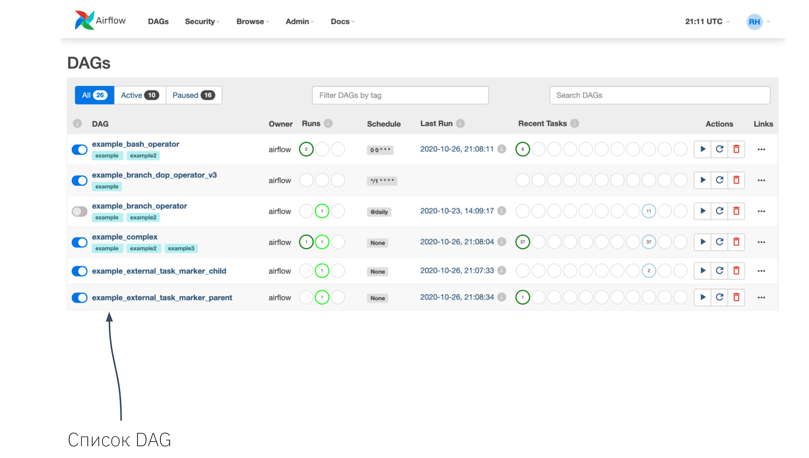

**Переключатели активности** — напротив каждого DAG находится кнопка-выключатель, позволяющая мгновенно активировать или деактивировать пайплайн прямо из веб-интерфейса без изменения кода.

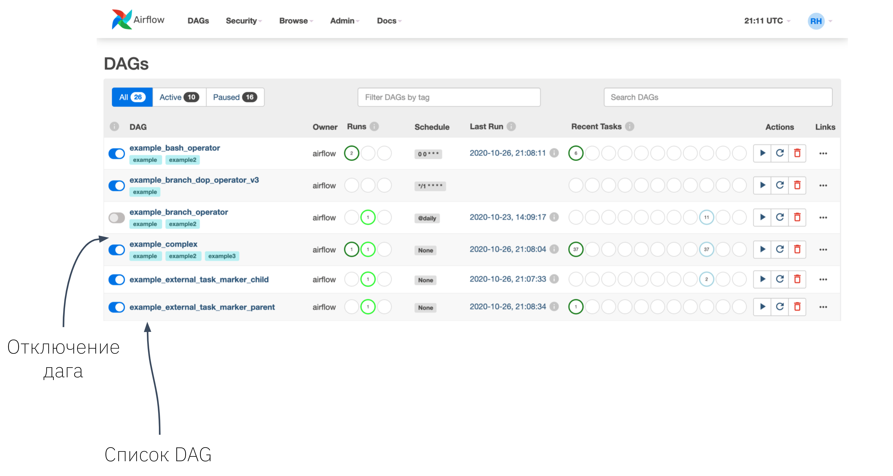

**Владелец процесса** — каждый пайплайн имеет ответственного владельца. Это особенно полезно в командной работе, когда несколько инженеров создают и поддерживают различные ETL-процессы. Владелец отвечает за мониторинг и корректную работу своего DAG.

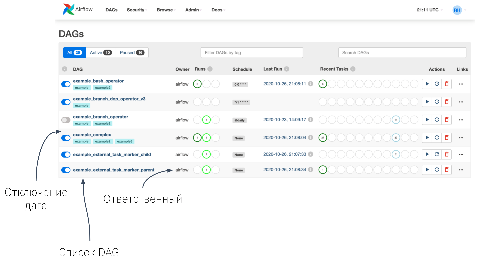

**Статус выполнения** — цветные индикаторы с цифрами показывают количество и состояние последних запусков DAG:
- 🔴 Красный — завершено с ошибкой (failed)
- 🟡 Желтый — ожидает повторного запуска (retry)  
- 🟢 Зеленый — выполняется в данный момент (running)
- 🟢 Тёмно-зеленый — успешно завершено (success)

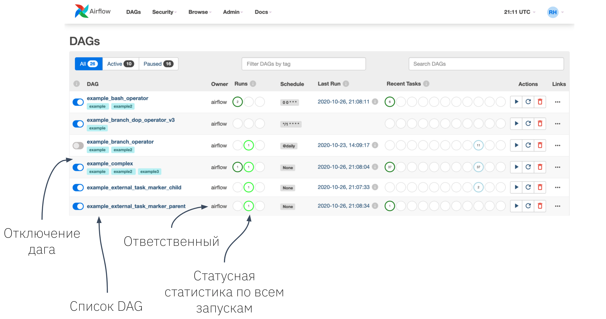

**Расписание** — указывает, когда и с какой периодичностью запускается пайплайн. Используется формат cron, который может показаться сложным на первый взгляд. Для перевода cron-выражений в понятный формат рекомендуем использовать сервис [Crontab.guru](https://crontab.guru/).

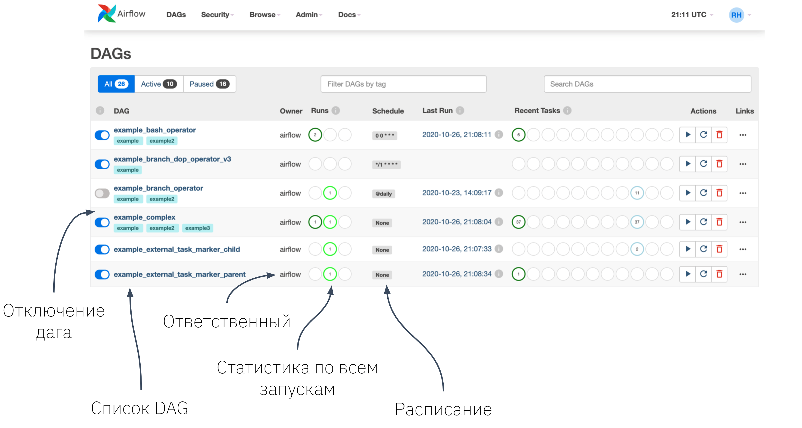

**Последний запуск** — показывает дату и время самого свежего выполнения DAG, будь то автоматический запуск по расписанию или ручной запуск.

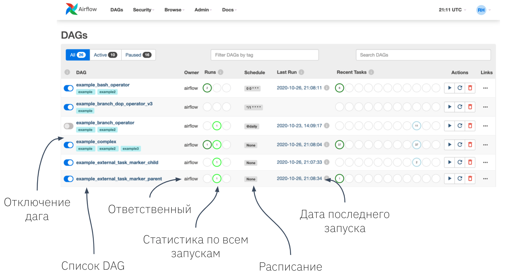

**Статус задач** — детальная информация о последнем запуске: сколько задач находится в каждом статусе. Это помогает быстро оценить общее состояние пайплайна без необходимости погружаться в детали.

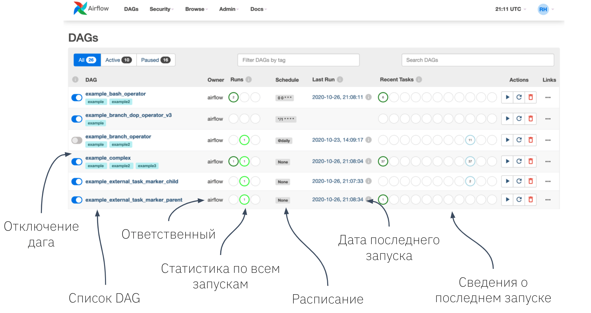

**Быстрые действия** — в последнем столбце расположены кнопки для немедленного выполнения операций: запуск, обновление и удаление DAG. На практике этими кнопками пользуются редко.

Главная страница дает вам общее представление о состоянии всех ваших процессов. Но для детальной работы с конкретным пайплайном нужно перейти внутрь — просто кликните по названию интересующего DAG.

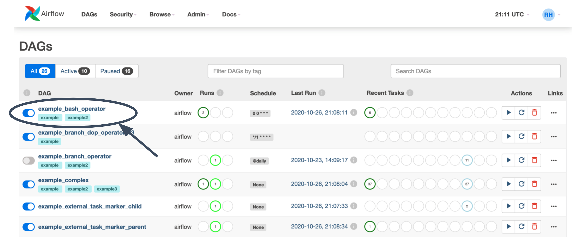

# Страница конкретного DAG

После перехода внутрь DAG вы увидите набор вкладок с различной информацией: от визуального представления структуры пайплайна до детальных логов выполнения и исходного кода.

## Древовидное представление (Tree View)

По умолчанию открывается вкладка с древовидной структурой задач. Здесь отображаются все запуски DAG с указанием статуса каждой задачи, времени выполнения и других метрик мониторинга.

Вы можете увидеть:
- Состав DAG и последовательность выполнения задач
- Тип оператора для каждой задачи
- Историю запусков в виде цветных квадратов напротив каждой задачи

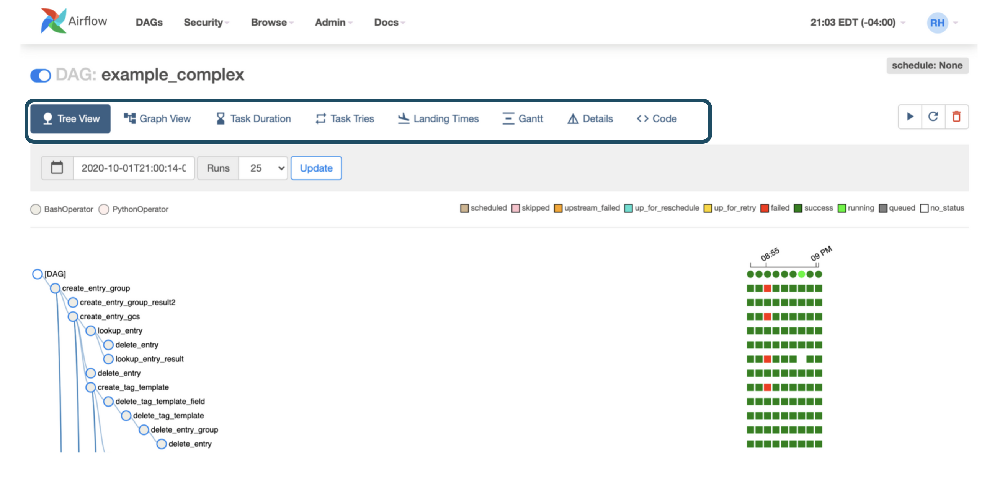
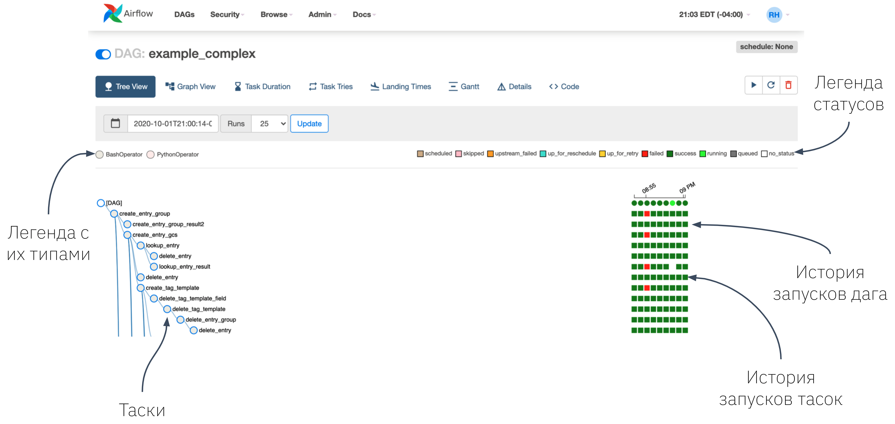

## Графическое представление (Graph View)

Когда DAG содержит много задач, древовидное представление может быть неудобным. В таких случаях используйте вкладку Graph View — она показывает пайплайн в виде наглядного графа с четкими связями между задачами.

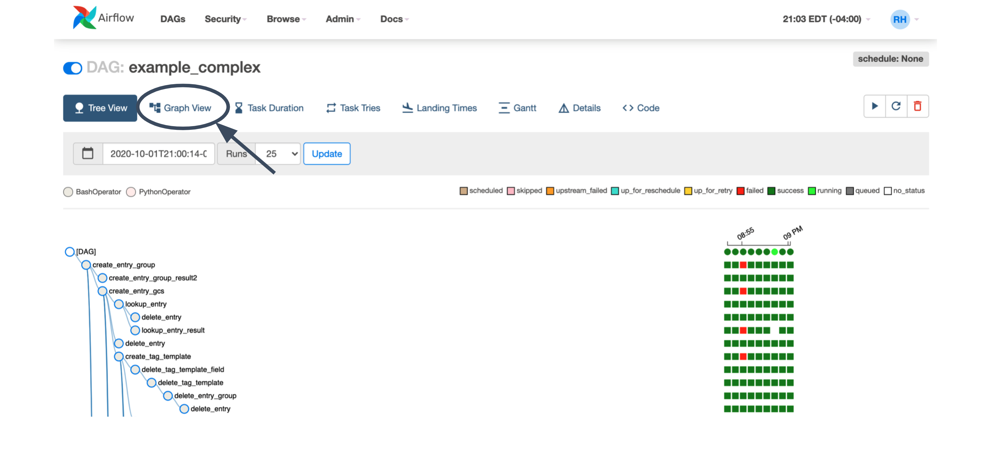
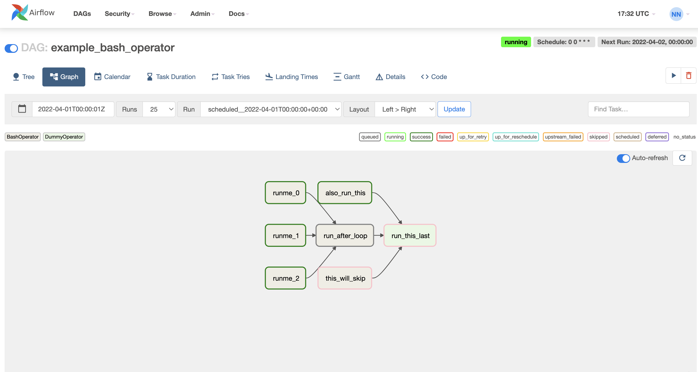

При клике на любую задачу открывается подробное окно с двумя основными разделами:

### Информация о задаче
- **Просмотр логов** — переход к странице с полным выводом выполнения задачи (одна из самых часто используемых функций)
- **Детали выполнения** — подробная информация о конкретном запуске задачи

### Управление задачей
Доступны четыре основных действия:
- **Запустить** — выполнить задачу немедленно
- **Очистить состояние** — сбросить статус задачи для повторного выполнения
- **Отметить как неудачную** — вручную установить статус ошибки
- **Отметить как успешную** — вручную установить статус успеха

Каждое действие можно комбинировать с дополнительными опциями:
- **Игнорировать зависимости** — запуск без проверки зависимостей от других задач
- **Работать с прошлыми/будущими запусками** — применить действие ко всем запускам в определенном временном диапазоне
- **Влиять на связанные задачи** — применить действие к предыдущим (upstream) или последующим (downstream) задачам

Наиболее популярная комбинация — **Downstream + Recursive + Clear**, которая сбрасывает текущую задачу и все зависящие от нее задачи в рамках одного запуска.

## Анализ времени выполнения (Task Duration)

Вкладка Task Duration автоматически строит графики на основе истории выполнения, показывая, сколько времени занимает каждая задача при каждом запуске. Это помогает выявлять узкие места и отслеживать изменения производительности.

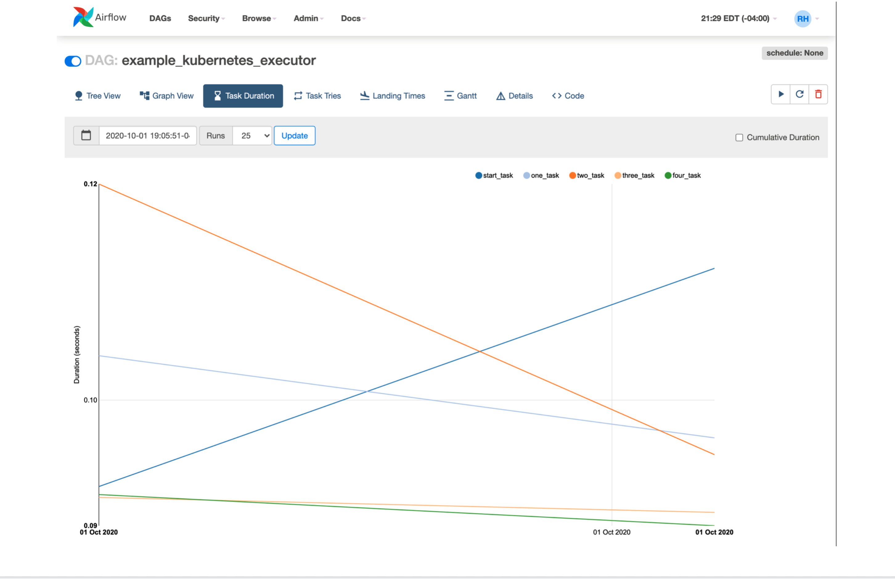

## Диаграмма Ганта (Gantt)

Диаграмма Ганта визуализирует распределение времени выполнения задач в рамках одного запуска DAG. Это отличный инструмент для определения самых ресурсоемких операций и планирования оптимизации.

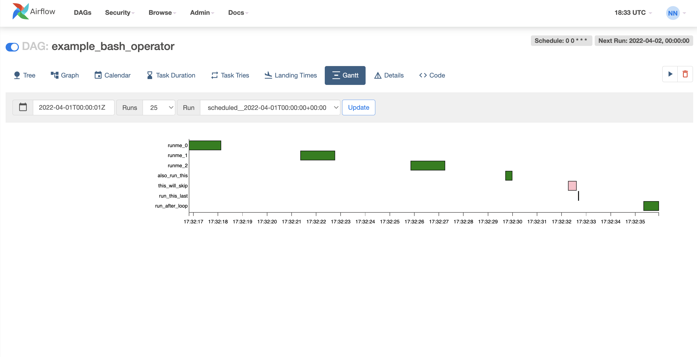

## Исходный код (Code)

Вкладка Code отображает актуальный код DAG, который Airflow использует для выполнения. Это особенно полезно для проверки, что изменения из вашего Git-репозитория успешно загружены в систему и готовы к выполнению.

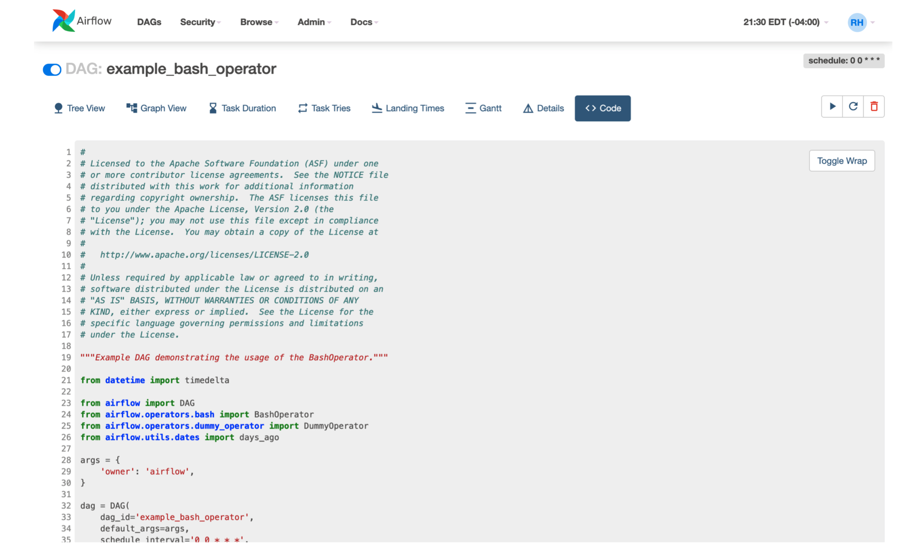

Теперь вы знакомы с основными возможностями веб-интерфейса Airflow для мониторинга и управления вашими процессами обработки данных. Эти знания помогут вам эффективно работать с пайплайнами и быстро решать возникающие проблемы.