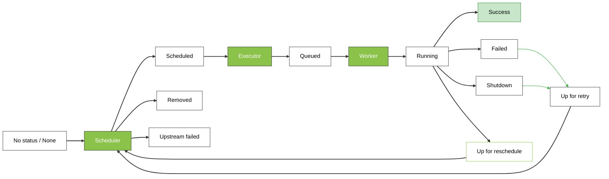

# Статусы задач в Airflow: как понимать и использовать

## Почему статусы задач так важны?

Когда вы только начинаете работать с Airflow, интерфейс может показаться сложным. Особенно если вы видите задачи разных цветов и не понимаете, что это значит. На самом деле, статусы задач — это ваш главный помощник в отладке и понимании того, что происходит с вашим пайплайном.

## Основные статусы, которые вы увидите каждый день

В интерфейсе Airflow каждая задача подсвечивается цветом — по нему можно быстро понять, что с ней происходит. Для первых шагов достаточно запомнить несколько базовых статусов, которые удобно разделить на три группы.

**1. Всё хорошо**

**🟢 Успешно (success)** — ваша задача выполнилась без ошибок. Это то, к чему мы стремимся!

**🟣 Пропущена (skipped)** — задача была намеренно пропущена (часто в ветвящихся пайплайнах).

**2. Есть проблема**

**🔴 Ошибка (failed)** — что-то пошло не так. Задача упала, и вам нужно разбираться в коде.

**3. Идёт работа или ожидание**

**🔵 Выполняется (running)** — задача сейчас активно работает. Просто подождите немного.

**🟡 В очереди (queued)** — задача ждет своей очереди на выполнение. Это нормально, особенно если у вас много задач или мало ресурсов.

**🟠 Запланирована (scheduled)** — все готово к запуску, Airflow вот-вот начнет выполнение.

**⚪ Нет статуса (none/no status)** — задача еще не готова к запуску, потому что не выполнены её зависимости.

### Специальные статусы (встречаются реже)

- **Ошибка в зависимости (upstream_failed)** — предыдущая задача упала, поэтому текущая даже не запускалась.
- **Готова к повтору (up_for_retry)** — задача упала, но Airflow попробует запустить её снова (если настроены повторные попытки).
- **Завершена (shutdown)** — задачу принудительно остановили во время выполнения.
- **Отложена (deferred)** — задача приостановлена и ждет внешнего события.
- **Наблюдение (sensing)** — специальный статус для сенсоров, которые ждут определенных условий.

## Как задача проходит свой путь: пошагово

Представьте, что у вас есть простая задача. Вот как она проходит свой жизненный цикл:

1. **Создание** → Статус: "Нет статуса"  
   Airflow создает задачу, но еще не может её запустить.

2. **Готовность** → Статус: "Запланирована"  
   Все зависимости выполнены, задача готова к работе.

3. **Ожидание** → Статус: "В очереди"  
   Задача ждет свободного рабочего места.

4. **Работа** → Статус: "Выполняется"  
   Задача активно выполняется.

5. **Завершение** → Статус: "Успешно"  
   Всё прошло отлично!

На диаграмме ниже показаны те же этапы, но уже с привязкой к внутренним компонентам Airflow.

### Легенда к диаграмме состояний задачи

**Зелёные блоки (Component)** — внутренние компоненты Airflow, которые двигают задачу по жизненному циклу:

- **Scheduler** — планировщик, проверяет зависимости задач и решает, что ставить в очередь.
- **Executor** — исполнитель, получает от Scheduler список задач и распределяет их по воркерам.
- **Worker** — рабочий процесс (worker), который фактически запускает код оператора.

**Белые блоки (Task stage)** — состояния конкретного запуска задачи (task instance, `TaskInstanceState`). На диаграмме они показывают, через какие шаги проходит задача от появления в DAG до успешного завершения или ошибки. Подробный справочник по всем состояниям есть в документации по ссылке ниже.

**Белые блоки с зелёной рамкой (Task stage only for sensor)** — состояния, характерные только для сенсоров:

- **Up for reschedule (`up_for_reschedule`)** — сенсор в режиме `reschedule`: условие ещё не выполнено, задача «усыплена» и позже будет снова поставлена в расписание без непрерывной работы воркера.

> Официальное описание всех состояний `TaskInstanceState` и их жизненного цикла смотрите в документации Airflow:  
> [Tasks → Task Instances](https://airflow.apache.org/docs/apache-airflow/stable/core-concepts/tasks.html#task-instances).

## Что делать, если задача упала?

Если вы видите красный статус (failed), не паникуйте! Это нормальная часть работы с данными. Вот что делать:

1. **Нажмите на задачу** в интерфейсе Airflow
2. **Посмотрите логи** — там будет точная причина ошибки
3. **Исправьте код** или настройки
4. **Перезапустите задачу** кнопкой "Clear"

## Советы для начинающих

- **Не бойтесь статусов** — они ваш друг, а не враг
- **Самые важные статусы** для начала: success, failed, queued, running
- **Остальные статусы** вы будете изучать по мере необходимости
- **Цвета в интерфейсе** — это быстрый способ понять состояние вашего пайплайна

Помните: понимание статусов задач — это как научиться читать дорожные знаки. Сначала кажется много информации, но со временем это становится второй натурой!

> Полный список возможных состояний задач (TaskInstanceState) и их классификацию на терминальные и промежуточные можно посмотреть в официальной документации Airflow:
> https://airflow.apache.org/docs/apache-airflow/2.9.3/_api/airflow/utils/state/index.html
 
