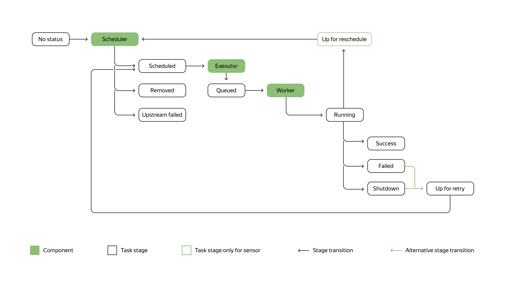

# Статусы задач в Airflow

# Статусы задач в Airflow — что означают цвета и как ими пользоваться

## Почему статусы задач так важны?

Когда вы только начинаете работать с Airflow, интерфейс может показаться сложным. Особенно если вы видите задачи разных цветов и не понимаете, что это значит. На самом деле, статусы задач — это ваш главный помощник в отладке и понимании того, что происходит с вашим пайплайном.

## Основные статусы, которые вы увидите каждый день

В интерфейсе Airflow каждая задача отображается определенным цветом. Вот что означают самые важные статусы:

### Простое объяснение всех статусов

Давайте разберем каждый статус простым языком:

**🟢 Успешно (success)** — ваша задача выполнилась без ошибок. Это то, к чему мы стремимся!

**🔴 Ошибка (failed)** — что-то пошло не так. Задача упала, и вам нужно разбираться в коде.

**🟡 В очереди (queued)** — задача ждет своей очереди на выполнение. Это нормально, особенно если у вас много задач или мало ресурсов.

**🔵 Выполняется (running)** — задача сейчас активно работает. Просто подождите немного.

**⚪ Нет статуса (none/no status)** — задача еще не готова к запуску, потому что не выполнены её зависимости.

**🟠 Запланирована (scheduled)** — все готово к запуску, Airflow вот-вот начнет выполнение.

**🟣 Пропущена (skipped)** — задача была намеренно пропущена (часто в ветвящихся пайплайнах).

### Специальные статусы (встречаются реже)

- **Ошибка в зависимости (upstream_failed)** — предыдущая задача упала, поэтому текущая даже не запускалась
- **Готова к повтору (up_for_retry)** — задача упала, но Airflow попробует запустить её снова (если настроены повторные попытки)
- **Завершена (shutdown)** — задачу принудительно остановили во время выполнения
- **Отложена (deferred)** — задача приостановлена и ждет внешнего события
- **Наблюдение (sensing)** — специальный статус для сенсоров, которые ждут определенных условий

## Как задача проходит свой путь: пошагово

Представьте, что у вас есть простая задача. Вот как она проходит свой жизненный цикл:

1. **Создание** → Статус: "Нет статуса"  
   Airflow создает задачу, но еще не может её запустить

2. **Готовность** → Статус: "Запланирована"  
   Все зависимости выполнены, задача готова к работе

3. **Ожидание** → Статус: "В очереди"  
   Задача ждет свободного рабочего места

4. **Работа** → Статус: "Выполняется"  
   Задача активно выполняется

5. **Завершение** → Статус: "Успешно"  
   Всё прошло отлично!

## Что делать, если задача упала?

Если вы видите красный статус (failed), не паникуйте! Это нормальная часть работы с данными. Вот что делать:

1. **Нажмите на задачу** в интерфейсе Airflow
2. **Посмотрите логи** — там будет точная причина ошибки
3. **Исправьте код** или настройки
4. **Перезапустите задачу** кнопкой "Clear"

## Советы для начинающих

- **Не бойтесь статусов** — они ваш друг, а не враг
- **Самые важные статусы** для начала: success, failed, queued, running
- **Остальные статусы** вы будете изучать по мере необходимости
- **Цвета в интерфейсе** — это быстрый способ понять состояние вашего пайплайна

Помните: понимание статусов задач — это как научиться читать дорожные знаки. Сначала кажется много информации, но со временем это становится второй натурой!