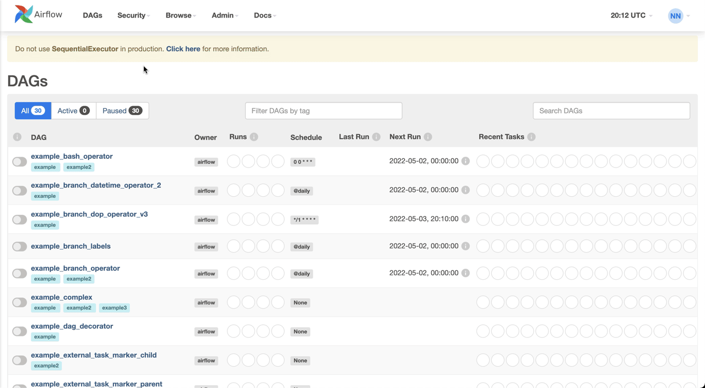
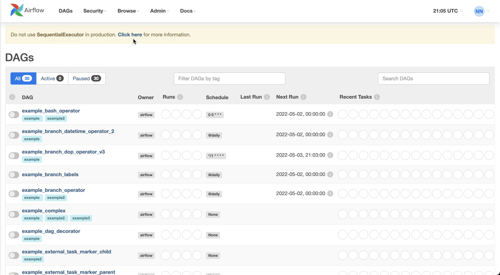

# Гибкие шаблоны и настройки в Airflow
В этом материале вы познакомитесь с мощными инструментами Airflow для создания гибких и переиспользуемых пайплайнов: динамическими шаблонами, безопасными переменными и централизованными подключениями к внешним системам.

# Динамические шаблоны Airflow (на основе Jinja)

В процессах обработки данных часто возникает необходимость использовать переменные значения, такие как дата выполнения задачи, для фильтрации исходных данных. В сложных сценариях может потребоваться информация о предыдущих успешных запусках или метаданные текущего выполнения. Airflow предоставляет встроенный механизм динамических шаблонов, основанный на языке Jinja, который значительно упрощает работу с такими переменными.

Синтаксис шаблонов интуитивно понятен — переменная заключается в двойные фигурные скобки с пробелами по краям. Для эффективного использования достаточно знать, какое значение возвращает конкретный шаблон, и разместить его в нужном месте кода.

Подробный справочник доступных шаблонов можно найти в [официальной документации Airflow](https://airflow.apache.org/docs/apache-airflow/stable/templates-ref.html#variables).

Вот практические примеры использования:

**Передача даты выполнения в задачу:**

В этом примере создается DAG с идентификатором "template_example", который запускается каждые 15 минут. Задача "display_date" использует шаблон {{ ds }} для вывода текущей даты выполнения в формате YYYY-MM-DD.
```python
...

dag = DAG(
    dag_id="dynamic_templates_example", 
    schedule_interval="*/10 * * * *", 
    default_args=default_args
) 

t1 = BashOperator(task_id="show_date", bash_command="echo {{ ds }}")

t1
```

**Использование шаблонов в идентификаторах задач для лучшей отслеживаемости:**

В этом примере создается DAG с идентификатором "template_tracking_example", который запускается каждые 20 минут. Вторая задача использует шаблон {{ ds }} в своем идентификаторе, что позволяет легко идентифицировать задачу по дате выполнения.
```python
...

dag = DAG(
    dag_id="dynamic_templates_example", 
    schedule_interval="*/10 * * * *", 
    default_args=default_args
) 

t1 = BashOperator(task_id="show_date", bash_command="echo {{ ds }}")
t2 = BashOperator(task_id=f"process_for_{{ ds }}", bash_command="echo {{ ds }}")

t1 >> t2
```

# Безопасные переменные (Variables)

Переменные Airflow представляют собой пары "ключ-значение", хранящиеся в метадатабазе системы. Они идеально подходят для хранения конфигурационных параметров, таких как пути к скриптам, имена таблиц или другие настройки, которые должны быть доступны в разных DAG.

Управление переменными осуществляется через веб-интерфейс Airflow (Admin → Variables), где можно:
- Создавать и редактировать пары ключ-значение вручную
- Импортировать настройки из JSON-файлов
- Использовать командную строку Airflow



Для защиты конфиденциальной информации Airflow автоматически маскирует значения переменных, в названии которых содержится слово "secret".

**Пример использования переменной в коде DAG:**

В этом примере создается DAG с идентификатором "variable_example", который использует переменную 'data_storage_path', предварительно сохраненную в Airflow. Значение переменной извлекается с помощью Variable.get() и используется в команде bash для указания пути к данным.
```python
from airflow import DAG
from airflow.operators.bash import BashOperator
from airflow.operators.dummy import DummyOperator
from airflow.models import Variable
from datetime import datetime

default_args = {
    'owner': 'data_team',
    'start_date': datetime(2023, 1, 1),
    'retries': 1,
}

dag = DAG(
    dag_id="variable_example",
    schedule_interval=None,
    default_args=default_args
)

# Получение значения переменной
data_path = Variable.get('data_storage_path')

task = BashOperator(
    task_id='process_data',
    bash_command=f'echo "Processing data from {data_path}"',
    dag=dag
)
```

Переменные делают код DAG более читаемым и модульным, позволяя легко адаптировать один и тот же пайплайн для разных окружений или сценариев использования.

# Централизованные подключения (Connections)

Подключения в Airflow — это безопасный способ хранения учетных данных и параметров для взаимодействия с внешними системами. Каждое подключение имеет уникальный идентификатор (conn_id) и содержит необходимые параметры: хост, порт, логин, пароль и другие специфичные настройки.

Подключения поддерживают широкий спектр систем:
- Базы данных (PostgreSQL, MySQL, Oracle и др.)
- Облачные хранилища (AWS S3, Google Cloud Storage)
- Системы уведомлений (Email, Telegram)
- И многие другие через Airflow Providers

При использовании операторов, взаимодействующих с внешними системами, Airflow автоматически ищет соответствующее подключение с суффиксом `_default`. Однако можно явно указать альтернативное подключение:

В приведенном примере используется PostgresOperator для создания таблицы в базе данных. Вместо использования подключения по умолчанию, явно указывается подключение с идентификатором 'my_postgres_conn'.

```python
from airflow.operators.postgres_operator import PostgresOperator

create_table = PostgresOperator(
    task_id='create_user_table',
    sql='''
        CREATE TABLE users(
        user_id integer NOT NULL,
        created_at TIMESTAMP NOT NULL
        );''',
    postgres_conn_id='my_postgres_conn'
)
```

Управление подключениями доступно через интерфейс Airflow (Admin → Connections). Если требуемый тип подключения отсутствует, его можно добавить установкой соответствующего Airflow Provider из [официального репозитория](https://airflow.apache.org/docs/#providers-packages-docs-apache-airflow-providers-index-html).



Для успешной работы с внешними системами сначала необходимо создать соответствующее подключение, а затем использовать его идентификатор в операторах вашего DAG.

Более подробную информацию о настройке подключений можно найти в [документации Airflow](https://airflow.apache.org/docs/apache-airflow/stable/howto/connection.html).

# Проверочный список для качественного DAG

После создания DAG задайте себе следующие вопросы для обеспечения его качества и безопасности:

- Сможет ли коллега понять и поддерживать этот DAG в моё отсутствие?
- Содержит ли код чувствительную информацию (логины, пароли, API-ключи)?
- Какие параметры можно вынести в переменные для лучшей гибкости?
- Требуется ли маскировка конфиденциальных значений?
- Используются ли в логике даты или временные метки, которые можно заменить на шаблоны?

Ответы на эти вопросы помогут вам создавать надежные, безопасные и легко поддерживаемые пайплайны в Airflow.