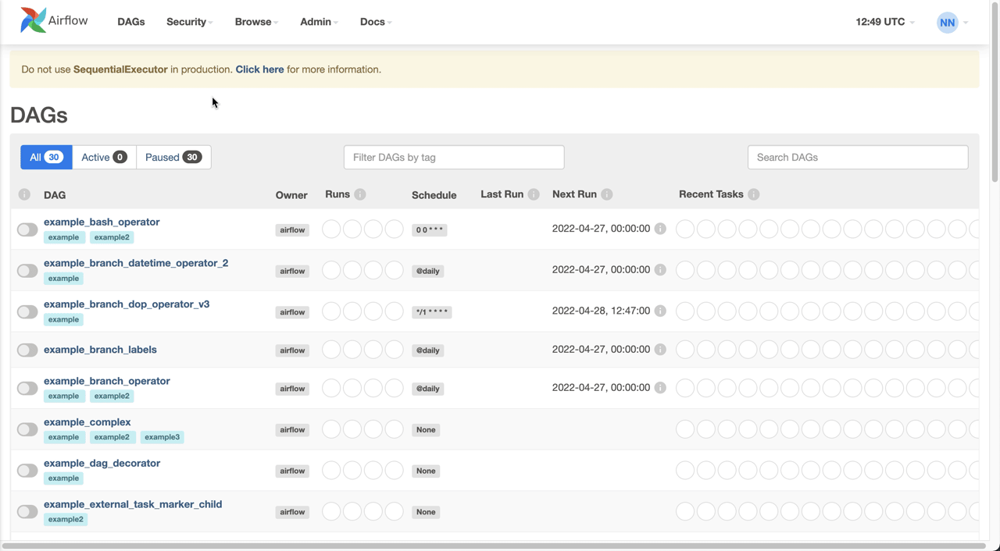
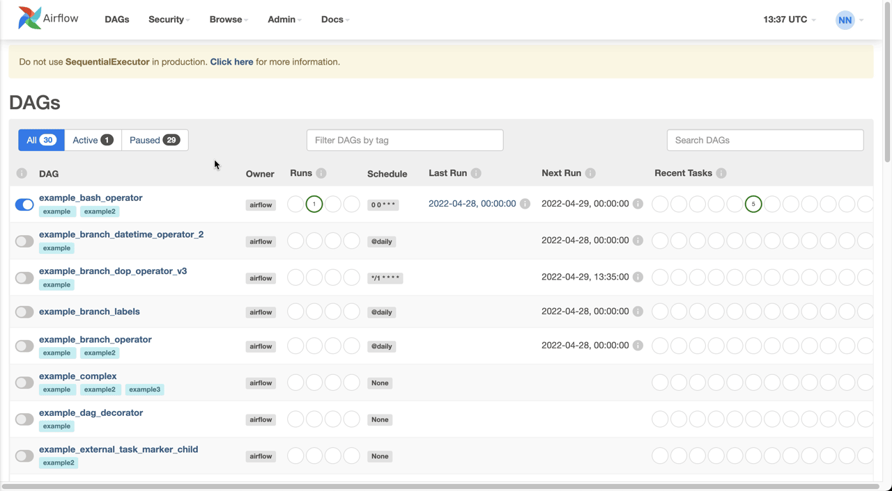
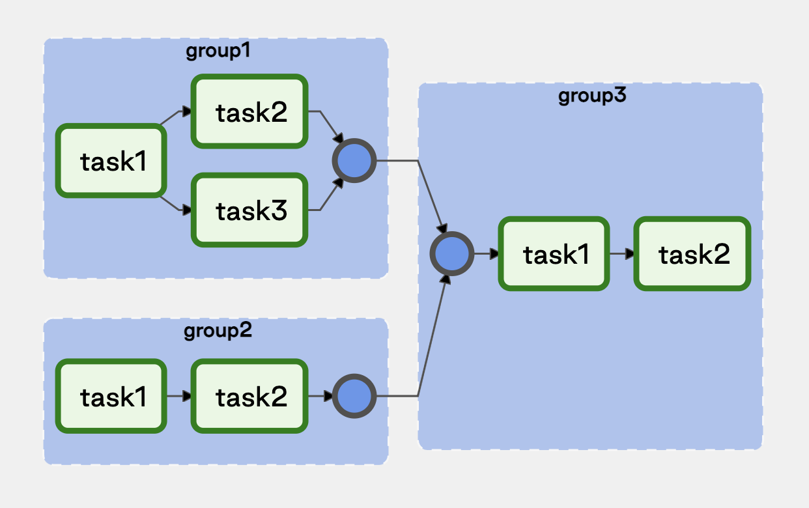
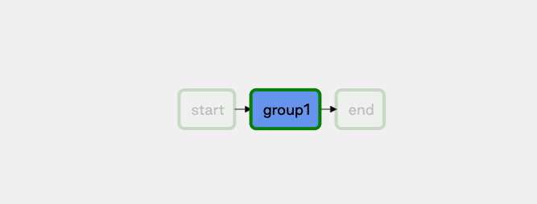

# Продвинутые возможности Airflow для начинающих специалистов

В этом материале мы познакомимся с расширенными функциями Airflow, которые помогут вам решать нетривиальные задачи при работе со сложными пайплайнами.

Начнем с улучшения нашего базового пайплайна — проведем рефакторинг кода для лучшей читаемости и поддержки.

## Управление ресурсами с помощью пулов задач

В системах с высокой нагрузкой, где одновременно запускается множество задач и DAG-ов, может возникнуть чрезмерная нагрузка на исполнителей и серверную часть. Это может привести к ошибкам выполнения и даже к отказу системы, если не установить соответствующие ограничения.

В Airflow для решения этой проблемы существует механизм управления ресурсами — **пулы задач** (pools). По умолчанию в Airflow настроен один пул задач — `default_pool` с 128 слотами, что означает возможность параллельного выполнения 128 задач одновременно. Пул `default_pool` нельзя удалить, но можно изменить его размер — увеличить или уменьшить количество слотов.

Когда планировщик обнаруживает, что наступило время выполнения DAG, он запускает задачу согласно заданной последовательности. При этом задача занимает один слот в пуле и освобождает его после завершения.

Создать новый пул задач и установить его размер можно через веб-интерфейс Airflow:



*Создание нового пула задач в Airflow*

Зачем нужны пулы задач? Они помогают:
- Организовать запуск процессов в системе
- Предотвратить перегрузку системы при выполнении большого количества ресурсоемких задач

Вы можете задать "вес" задачи через параметр `pool_slots`, чтобы оптимизировать распределение нагрузки. Если общее количество задач превышает доступные слоты, планировщик поставит задачу в очередь и запустит ее, как только появятся свободные ресурсы.

Пример настройки веса задач:

В приведенном примере показано, как можно настроить использование пула задач с различным весом. Задача 'data_backup_task' использует 3 слота в пуле 'data_processing_pool', что делает ее более ресурсоемкой по сравнению с задачами 'file_check_task' и 'cleanup_task', которые используют по 1 слоту. Это позволяет контролировать распределение ресурсов между различными задачами.

```python
BashOperator(
    task_id="data_backup_task",
    bash_command="bash backup_script.sh",
    pool_slots=3,
    pool="data_processing_pool",
)

BashOperator(
    task_id="file_check_task",
    bash_command="bash validate_files.sh",
    pool_slots=1,
    pool="data_processing_pool",
)

BashOperator(
    task_id="cleanup_task",
    bash_command="bash cleanup_files.sh",
    pool_slots=1,
    pool="data_processing_pool",
)
```

Более подробную информацию о механизме пулов можно найти в [официальной документации](https://airflow.apache.org/docs/apache-airflow/stable/concepts/pools.html#pools).

## Обмен данными между задачами: XCom и контекст выполнения

**XCom** (от англ. cross-communications — «межзадачная коммуникация») — это механизм обмена сообщениями между задачами внутри одного DAG. Архитектурно каждая задача изолирована от других и работает в собственном контексте.

💡 **Контекст выполнения** — это набор параметров, передаваемых при запуске задачи, а также метаданные, генерируемые во время выполнения: время старта, время завершения, имя DAG и другие. Контекст можно найти следующим образом:

{:height 437, :width 778}

В XCom можно передавать сериализованные объекты. Значения XCom хранятся в базе данных Airflow и доступны через интерфейс:



*XCom в веб-интерфейсе Airflow*

**Важное правило**: XCom предназначен для обмена небольшими сообщениями. Данные проходят сериализацию/десериализацию при чтении и записи в таблицу.

💡 **Сериализация** — процесс преобразования структуры данных в последовательность байтов. **Десериализация** — восстановление структуры данных из байтовой последовательности.

Для передачи больших объемов данных используйте внешние средства: файловую систему, базы данных (чаще всего PostgreSQL) или очереди сообщений (например, Kafka).

Механизм XCom похож на работу функций в Python. Многие операторы по умолчанию возвращают результат выполнения задачи. За это отвечает параметр `do_xcom_push`, который по умолчанию равен `True`.

Чтобы прочитать сообщения из XCom, используйте метод `xcom_pull` в контексте задачи:

В этом примере мы получаем результат выполнения задачи с идентификатором 'data_processing_task' с помощью метода xcom_pull. Это позволяет передавать небольшие объемы данных между задачами в рамках одного DAG.

```python
result = task_instance.xcom_pull(task_ids='data_processing_task')
```

Также можно обращаться к сообщениям через Jinja-шаблоны:

```
SELECT * FROM {{ task_instance.xcom_pull(task_ids='foo', key='table_name') }}
```

Если оператор возвращает значение и параметр `do_xcom_push` установлен в `True` (по умолчанию), это значение автоматически записывается в XCom.

Пример явного запрета записи в XCom:

В этом примере задача 'show_directory_contents' создается с параметром do_xcom_push=False, что означает, что результат выполнения этой задачи не будет автоматически сохранен в XCom. Это полезно, когда вы не хотите, чтобы задача передавала какие-либо данные другим задачам через XCom.

```python
list_files = BashOperator(
    task_id='show_directory_contents',
    bash_command='ls -la',
    do_xcom_push=False
)

def calculate_sum():
    return 2 + 3
```

Пример автоматической записи в XCom (параметр `do_xcom_push` по умолчанию `True`):

В этом примере задача 'calculate_sum' автоматически записывает результат выполнения функции calculate_sum в XCom, так как параметр do_xcom_push по умолчанию установлен в True. Это позволяет использовать результат этой задачи в других задачах DAG через XCom.

```python
sum_result = PythonOperator(
    task_id='calculate_sum',
    python_callable=calculate_sum,
)
```

XCom похожи на переменные (variables) в Airflow, но предназначены именно для взаимодействия между задачами в рамках одного DAG, а не для глобальных настроек.

XCom упрощает взаимодействие между задачами и применяется в различных сценариях.

## Группировка задач с помощью TaskGroup

Для удобства визуализации задачи можно группировать в веб-интерфейсе Airflow (начиная с версии 2.0). Повторяющиеся или логически связанные задачи можно объединить в группы:

В этом примере задачи сгруппированы в три логические группы: 'data_extraction', 'data_transformation' и 'data_loading'. Каждая группа содержит несколько задач, которые выполняются последовательно внутри группы. Затем группы связаны между собой, чтобы показать общий порядок выполнения этапов обработки данных.

```python
with TaskGroup("data_extraction") as extraction_group:
    extract_1 = DummyOperator(task_id="extract_source_1")
    extract_2 = DummyOperator(task_id="extract_source_2")
    extract_3 = DummyOperator(task_id="extract_source_3")
    extract_1 >> extract_2 >> extract_3

with TaskGroup("data_transformation") as transformation_group:
    transform_1 = DummyOperator(task_id="transform_step_1")
    transform_2 = DummyOperator(task_id="transform_step_2")
    transform_1 >> transform_2

with TaskGroup("data_loading") as loading_group:
    load_1 = DummyOperator(task_id="load_to_target_1")
    load_2 = DummyOperator(task_id="load_to_target_2")
    load_1 >> load_2

[extraction_group, transformation_group] >> loading_group
```

Обратите внимание: при использовании TaskGroup последовательность задач указывается внутри группы после объявления всех задач, а в конце DAG описывается последовательность выполнения самих групп.

Визуально в интерфейсе Airflow это выглядит так:



*Группировка задач с помощью TaskGroup*

TaskGroup добавляет интерактивность в веб-интерфейс — группы задач можно сворачивать и разворачивать, что значительно улучшает восприятие DAG с большим количеством задач и связей:



*Группу задач можно раскрыть для детального просмотра*

TaskGroup — это удобный способ логической группировки задач, который помогает упростить код и представить сложные пайплайны более компактно.

## Система оповещений (алертинг)

Алертинг — один из ключевых компонентов системы оркестрации, так как важно своевременно получать уведомления об ошибках для их оперативного анализа и решения.

По умолчанию в Airflow настроена отправка уведомлений на электронную почту. При создании DAG указываются email-адреса, на которые будут отправляться сообщения. С помощью параметров можно настроить различные сценарии оповещений.

Давайте модифицируем наш первый DAG так, чтобы получать уведомления на почту при возникновении ошибок. При этом настроим перезапуск задач в случае неудачи (например, 2 попытки), но без уведомлений о самих перезапусках:

В приведенном примере создан DAG с идентификатором 'customer_analysis_pipeline', который настроен на отправку уведомлений по электронной почте только при ошибках (email_on_failure=True), но не при повторных попытках (email_on_retry=False). Также установлено 2 попытки повторного запуска задач при ошибках с задержкой 2 минуты между попытками.

```python
import os
import datetime as dt
import pandas as pd
from airflow.models import DAG
from airflow.operators.python import PythonOperator
from airflow.operators.bash import BashOperator
from sqlalchemy import create_engine

# основные параметры DAG
args = {
    'owner': 'data_engineering_team',
    'start_date': dt.datetime(2021, 6, 15),
    'retries': 2,
    'retry_delay': dt.timedelta(minutes=2),
    'email': ["data-team@example.com"],
    'email_on_failure': True,
    'email_on_retry': False,
}

dag = DAG(
    dag_id='customer_analysis_pipeline',
    schedule_interval=None,
    default_args=args,
)
```

Теперь вы будете получать email-уведомления при ошибках выполнения.

Пример функции для отправки уведомлений с использованием параметров из контекста:

```python
from datetime import datetime, timedelta, timezone
import dateutil
from airflow.utils.email import send_email_smtp

MAIL_LIST = [
    "email_1@gmail.ru",
    "email_2@gmail.ru"
]

def notify_email(calculation_dt: str, dagrun_begin_time, **context):
    # dag_run date is utc timezone, so add `timezone.utc` to calculation_end to combat 3 hour diff.
    calculation_start = dateutil.parser.isoparse(dagrun_begin_time.replace('Z', '+00:00'))
    calculation_end = datetime.now(timezone.utc)
    duration = str(timedelta(seconds=(calculation_end - calculation_start).seconds))
    
    title = f"Ежедневные расчёты завершились успешно (dag: {context['task_instance'].dag_id})."
    
    body = f"""
        Привет, <br>
        Я закончил работу над расчётом за "{calculation_dt}". Это заняло {duration} часов/минут/секунд.<br>
        Логи и запуски тоже можно посмотреть <a href="http://airflow-monitoring.example.com/tree?dag_id=daily_guests_features">тут</a>.
        <br>
        
        <br>
        <br>
        Навеки твой,<br>
        Airflow бот <br>
        """
    
    send_email_smtp(";".join(MAIL_LIST), title, body)
```

Такую функцию можно разместить в отдельном файле (например, `utils.py`), импортировать как модуль в нужных DAG и вызывать отдельной задачей:

```python
from airflow.operators.python import PythonOperator
from utils import notify_email

LOCAL_CALCULATION_DT = '{{ dag.timezone.convert(execution_date).strftime("%Y-%m-%d") }}'
DAG_RUN_BEGIN_TIME = "{{ dag_run.start_date }}"

email_notification_task = PythonOperator(
    task_id="send_email_notification",
    python_callable=notify_email,
    provide_context=True,
    dag=dag,
    trigger_rule=TriggerRule.ALL_DONE,
    op_args=[LOCAL_CALCULATION_DT, DAG_RUN_BEGIN_TIME],
)

... >> email_notification_task
```

## Практическое применение: улучшенный DAG

Теперь применим изученные концепции для усовершенствования нашего DAG. Добавим переменные и разобьем задачи на логические группы.

Сначала создадим переменную `DATABASE_URL` со строкой подключения к базе данных через веб-интерфейс Airflow и импортируем ее в коде DAG:

В этом примере используется переменная 'database_connection_string', предварительно созданная в интерфейсе Airflow, для хранения строки подключения к базе данных. Это позволяет избежать жесткого кодирования конфиденциальной информации в коде DAG и упрощает настройку подключения для разных окружений.

```python
import datetime as dt
import pandas as pd
from airflow.models import DAG
from airflow.operators.bash import BashOperator
from airflow.operators.python import PythonOperator
from airflow.operators.dummy import DummyOperator
from airflow.utils.task_group import TaskGroup
from airflow.models import Variable
from sqlalchemy import create_engine

DATABASE_URL = Variable.get('database_connection_string')

args = {
    'owner': 'analytics_team',
    'start_date': dt.datetime(2021, 6, 15),
    'retries': 2,
    'retry_delay': dt.timedelta(minutes=2),
}

# функции для обработки данных
def get_file_path(file_name):
    return os.path.join(os.path.expanduser('~/data'), file_name)

def load_customer_data():
    url = 'https://example.com/customer_data.csv'
    df = pd.read_csv(url)
    engine = create_engine(DATABASE_URL)
    df.to_sql('customers', engine, index=False, if_exists='replace', schema='staging')

def aggregate_customer_data():
    engine = create_engine(DATABASE_URL)
    customer_df = pd.read_sql('select * from staging.customers', con=engine)
    
    df = customer_df.groupby(['region', 'category']).agg(
            total_orders=('orders', 'sum'),
            avg_amount=('amount', 'mean')
        ).reset_index()
    
    df.to_sql('customer_summary', engine, index=False, if_exists='replace', schema='analytics')

dag = DAG(
    dag_id='customer_pipeline_enhanced',
    schedule_interval=None,
    default_args=args,
)
```

Теперь разобьем задачи на логические группы и добавим Jinja-шаблоны для доступа к контексту выполнения:

В этом примере создается начальная задача 'pipeline_start', которая использует Jinja-шаблоны для вывода информации о запуске DAG, включая идентификатор запуска (run_id) и информацию о DAG Run. Затем задачи группируются в логическую группу 'data_processing_stage', что улучшает структуру и читаемость DAG.

```python
# Начальная задача с информацией о запуске
start_task = BashOperator(
    task_id='pipeline_start',
    bash_command='echo "Pipeline started! Run ID: {{ run_id }} | DAG Run: {{ dag_run }}"',
    dag=dag,
)

# Группа задач по предварительной обработке данных
with TaskGroup(group_id="data_processing_stage") as data_processing:
    # Загрузка данных
    load_customer_dataset = PythonOperator(
        task_id='load_customer_data',
        python_callable=load_customer_data,
        dag=dag,
    )
    # Агрегация и запись данных
    aggregate_customer_dataset = PythonOperator(
        task_id='aggregate_customer_data',
        python_callable=aggregate_customer_data,
        dag=dag,
    )
    load_customer_dataset >> aggregate_customer_dataset

# Установка последовательности выполнения
start_task >> data_processing
```

Поскольку последовательность задач внутри групп указывается при их создании, в конце необходимо определить порядок выполнения самих групп, чтобы планировщик понимал общую логику выполнения.

Итоговый DAG будет выглядеть следующим образом:

```python
import datetime as dt
import pandas as pd
from airflow.models import DAG
from airflow.operators.bash import BashOperator
from airflow.operators.python import PythonOperator
from airflow.operators.dummy import DummyOperator
from airflow.utils.task_group import TaskGroup
from airflow.models import Variable
from sqlalchemy import create_engine

DATABASE_URL = Variable.get('database_connection_string')

args = {
    'owner': 'analytics_team',
    'start_date': dt.datetime(2021, 6, 15),
    'retries': 2,
    'retry_delay': dt.timedelta(minutes=2),
}

def get_file_path(file_name):
    return os.path.join(os.path.expanduser('~/data'), file_name)

def load_customer_data():
    url = 'https://example.com/customer_data.csv'
    df = pd.read_csv(url)
    engine = create_engine(DATABASE_URL)
    df.to_sql('customers', engine, index=False, if_exists='replace', schema='staging')

def aggregate_customer_data():
    engine = create_engine(DATABASE_URL)
    customer_df = pd.read_sql('select * from staging.customers', con=engine)
    
    df = customer_df.groupby(['region', 'category']).agg(
            total_orders=('orders', 'sum'),
            avg_amount=('amount', 'mean')
        ).reset_index()
    
    df.to_sql('customer_summary', engine, index=False, if_exists='replace', schema='analytics')

dag = DAG(
    dag_id='customer_pipeline_enhanced',
    schedule_interval=None,
    default_args=args,
)

# Начальная задача
start_task = BashOperator(
    task_id='pipeline_start',
    bash_command='echo "Pipeline started! Run ID: {{ run_id }} | DAG Run: {{ dag_run }}"',
    dag=dag,
)

# Группа предварительной обработки
with TaskGroup(group_id="data_processing_stage") as data_processing:
    load_customer_dataset = PythonOperator(
        task_id='load_customer_data',
        python_callable=load_customer_data,
        dag=dag,
    )
    aggregate_customer_dataset = PythonOperator(
        task_id='aggregate_customer_data',
        python_callable=aggregate_customer_data,
        dag=dag,
    )
    load_customer_dataset >> aggregate_customer_dataset

start_task >> data_processing
```

В этом материале мы рассмотрели расширенные возможности Airflow, которые помогут улучшить работу ваших пайплайнов:
- Управление ресурсами с помощью пулов задач
- Обмен данными между задачами через XCom
- Логическая группировка задач с TaskGroup
- Настройка системы оповещений

Помните: не стоит использовать все доступные функции сразу. Выбирайте инструменты последовательно и находите оптимальный набор возможностей под конкретную задачу.