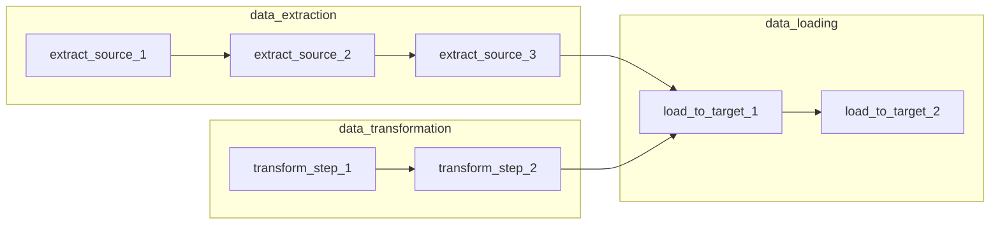

# Пулы, XCom, TaskGroup и алертинг в Airflow

В этом материале мы познакомимся с управлением ресурсами через пулы задач, обменом данными между задачами через XCom, группировкой задач с помощью TaskGroup и настройкой системы оповещений (алертинга) в Airflow.

Опыты с этими возможностями собраны в [блоке 8 практики](educational-tasks.md#resources); callback и ошибки разобраны в [блоке 7](educational-tasks.md#errors).

## Управление ресурсами с помощью пулов задач

В системах с высокой нагрузкой, где одновременно запускается множество задач и DAG-ов, может возникнуть чрезмерная нагрузка на исполнителей и серверную часть. Это может привести к ошибкам выполнения и даже к отказу системы, если не установить соответствующие ограничения.

В Airflow для решения этой проблемы существует механизм управления ресурсами — **пулы задач** (pools). По умолчанию в Airflow настроен один пул задач — `default_pool` с 128 слотами. При стандартном `pool_slots=1` это верхняя граница в 128 одновременно работающих задач; ограничения executor и DAG могут уменьшить ее. Пул `default_pool` нельзя удалить, но можно изменить его размер — увеличить или уменьшить количество слотов.

Когда планировщик обнаруживает, что наступило время выполнения DAG, он запускает задачу согласно заданной последовательности. По умолчанию задача занимает один слот в пуле и освобождает его после завершения.

Создать новый пул задач и установить его размер можно через веб-интерфейс Airflow. Рассмотрим пример пула `data_processing_pool` для тяжёлых задач:

1. В верхнем меню откройте **Admin → Pools**.
2. Нажмите кнопку **+** или **Create**.
3. В поле **Name** укажите, например, `data_processing_pool`.
4. В поле **Slots** задайте количество слотов, например `5`  
   (это значит, что одновременно смогут выполняться не более 5 задач из этого пула).
5. При желании заполните **Description** — например, `Пул для тяжёлых задач бэкапа`.
6. Нажмите **Save**.

После этого в задачах можно указать параметр `pool="data_processing_pool"`, и они будут занимать слоты именно этого пула.


Зачем нужны пулы задач? Они помогают:
- Организовать запуск процессов в системе
- Предотвратить перегрузку системы при выполнении большого количества ресурсоемких задач

Вы можете задать "вес" задачи через параметр `pool_slots`, чтобы оптимизировать распределение нагрузки. Планировщик учитывает сумму занятых слотов. Например, в пуле из двух слотов задачи с `pool_slots=2` и `pool_slots=1` не смогут работать одновременно: одна ждет завершения другой.

Пример настройки веса задач:

В приведенном примере показано, как можно настроить использование пула задач с различным весом. Задача 'data_backup_task' использует 3 слота в пуле 'data_processing_pool', что делает ее более ресурсоемкой по сравнению с задачами 'file_check_task' и 'cleanup_task', которые используют по 1 слоту. Это позволяет контролировать распределение ресурсов между различными задачами.

```python
BashOperator(
    task_id="data_backup_task",
    bash_command="bash backup_script.sh",
    pool_slots=3,
    pool="data_processing_pool",
)

BashOperator(
    task_id="file_check_task",
    bash_command="bash validate_files.sh",
    pool_slots=1,
    pool="data_processing_pool",
)

BashOperator(
    task_id="cleanup_task",
    bash_command="bash cleanup_files.sh",
    pool_slots=1,
    pool="data_processing_pool",
)
```

Более подробную информацию о механизме пулов можно найти в [официальной документации](https://airflow.apache.org/docs/apache-airflow/2.9.2/administration-and-deployment/pools.html).

## Обмен данными между задачами: XCom и контекст выполнения

**XCom** (от англ. cross-communications — «межзадачная коммуникация») — это механизм обмена сообщениями между задачами внутри одного DAG. Архитектурно каждая задача изолирована от других и работает в собственном контексте.

💡 **Контекст выполнения** — это набор параметров, передаваемых при запуске задачи, а также метаданные, генерируемые во время выполнения: время старта, время завершения, имя DAG и другие. Контекст можно найти следующим образом:

1. Откройте веб-интерфейс Airflow и перейдите на вкладку **DAGs**.
2. Найдите нужный DAG и кликните по его имени.
3. На странице DAG убедитесь, что открыта вкладка **Grid**.
4. В сетке выберите нужный запуск DAG (колонка) и задачу (строка) и кликните по цветному квадратику задачи.
5. Справа откроется панель **Task Instance** (детали экземпляра задачи). В ней можно увидеть:
   - `dag_id` и `task_id`;
   - логическую дату запуска (**logical_date / execution_date**);
   - текущий статус, время старта и завершения;
   - ссылки на лог, XCom и другую служебную информацию.

Именно эти поля и составляют большую часть «контекста выполнения», который доступен в Jinja-шаблонах через объекты вроде `{{ dag_run }}` и `{{ task_instance }}`.

В XCom можно передавать сериализованные объекты. Значения XCom хранятся в базе данных Airflow и доступны через интерфейс.

Посмотреть XCom можно двумя способами.

**1. Через конкретную задачу в DAG**

1. Откройте нужный DAG и вкладку **Grid**.
2. Найдите нужный запуск и кликните по квадратику задачи.
3. В правой панели **Task Instance** перейдите на вкладку **XCom**.
4. В таблице вы увидите все XCom-записи для этого экземпляра задачи: ключ (`key`), значение (`value`), время создания и т. д.

**2. Через общий список XCom**

1. В верхнем меню выберите **Browse → XComs**.
2. Отфильтруйте записи по `dag_id`, `task_id` или другим полям, если нужно.
3. Откройте интересующую запись, чтобы увидеть её содержимое.

**Важное правило**: XCom предназначен для обмена небольшими сообщениями. Данные проходят сериализацию/десериализацию при чтении и записи в таблицу.

💡 **Сериализация** — процесс преобразования структуры данных в последовательность байтов. **Десериализация** — восстановление структуры данных из байтовой последовательности.

Для передачи больших объемов данных используйте внешние средства: файловую систему, базы данных (чаще всего PostgreSQL) или очереди сообщений (например, Kafka).

Механизм XCom похож на работу функций в Python. Многие операторы (например, `PythonOperator`) по умолчанию возвращают результат выполнения задачи. За это отвечает параметр `do_xcom_push`, который во многих случаях равен `True` по умолчанию.

Чтобы прочитать сообщения из XCom, используйте метод `xcom_pull` в контексте задачи:

В этом примере мы получаем результат выполнения задачи с идентификатором 'data_processing_task' с помощью метода xcom_pull. Это позволяет передавать небольшие объемы данных между задачами в рамках одного DAG.

```python
result = task_instance.xcom_pull(task_ids='data_processing_task')
```

Также можно обращаться к сообщениям через Jinja-шаблоны:

```
SELECT * FROM {{ task_instance.xcom_pull(task_ids='foo', key='table_name') }}
```

Если оператор возвращает значение и параметр `do_xcom_push` установлен в `True` (по умолчанию), это значение автоматически записывается в XCom.

Пример явного запрета записи в XCom:

В этом примере задача 'show_directory_contents' создается с параметром do_xcom_push=False, что означает, что результат выполнения этой задачи не будет автоматически сохранен в XCom. Это полезно, когда вы не хотите, чтобы задача передавала какие-либо данные другим задачам через XCom.

```python
list_files = BashOperator(
    task_id='show_directory_contents',
    bash_command='ls -la',
    do_xcom_push=False
)

def calculate_sum():
    return 2 + 3
```

Пример автоматической записи в XCom (параметр `do_xcom_push` по умолчанию `True`):

В этом примере задача 'calculate_sum' автоматически записывает результат выполнения функции calculate_sum в XCom, так как параметр do_xcom_push по умолчанию установлен в True. Это позволяет использовать результат этой задачи в других задачах DAG через XCom.

```python
sum_result = PythonOperator(
    task_id='calculate_sum',
    python_callable=calculate_sum,
)
```

XCom похожи на переменные (variables) в Airflow, но предназначены именно для взаимодействия между задачами в рамках одного DAG, а не для глобальных настроек.

XCom упрощает взаимодействие между задачами и применяется в различных сценариях.

## Группировка задач с помощью TaskGroup

TaskGroup объединяет задачи в сворачиваемую группу на графе. Зависимости и состояния остаются у отдельных задач. Группировку задают в Python-коде; UI позволяет раскрыть ее и посмотреть содержимое.

В примере три группы. Внутри каждой задачи идут последовательно. Группы извлечения и преобразования независимы, а загрузка ждет завершения обеих. `EmptyOperator` ничего не обрабатывает: здесь мы смотрим только на устройство графа.

```python
from datetime import datetime

from airflow import DAG
from airflow.operators.empty import EmptyOperator
from airflow.utils.task_group import TaskGroup

with DAG(
    dag_id="task_group_example",
    start_date=datetime(2023, 1, 1),
    schedule=None,
    catchup=False,
) as dag:
    with TaskGroup("data_extraction") as extraction_group:
        extract_1 = EmptyOperator(task_id="extract_source_1")
        extract_2 = EmptyOperator(task_id="extract_source_2")
        extract_3 = EmptyOperator(task_id="extract_source_3")
        extract_1 >> extract_2 >> extract_3

    with TaskGroup("data_transformation") as transformation_group:
        transform_1 = EmptyOperator(task_id="transform_step_1")
        transform_2 = EmptyOperator(task_id="transform_step_2")
        transform_1 >> transform_2

    with TaskGroup("data_loading") as loading_group:
        load_1 = EmptyOperator(task_id="load_to_target_1")
        load_2 = EmptyOperator(task_id="load_to_target_2")
        load_1 >> load_2

    [extraction_group, transformation_group] >> loading_group
```

Здесь TaskGroup создается внутри `with DAG(...)`, поэтому группа и ее задачи получают один DAG. При отдельном объявлении `dag = DAG(...)` группу нужно привязать явно: `TaskGroup("data_extraction", dag=dag)`.

Схема повторяет зависимости из кода:



Для запуска сохраните пример в `airflow-docker/dags/task_group_example_dag.py`. После ручного запуска все семь задач должны завершиться успешно. Нажмите название группы со стрелкой, чтобы раскрыть ее. Полный идентификатор первой задачи - `data_extraction.extract_source_1`: имя группы становится префиксом `task_id`. Такой идентификатор нужен при обращении к задаче через XCom.

## Система оповещений (алертинг)

Для первого опыта достаточно callback с записью в лог. Он получает контекст задачи и помогает связать сообщение с конкретным запуском:

```python
import logging


def notify_failure(context):
    ti = context["ti"]
    logging.error(
        "Ошибка: dag=%s task=%s run=%s причина=%s",
        ti.dag_id, ti.task_id, context["run_id"], context["exception"],
    )
```

Укажите `on_failure_callback=notify_failure` в рабочем операторе. Функция вызывается после окончательного отказа, когда повторы исчерпаны. Для сообщения о предстоящем повторе существует `on_retry_callback`. Например, при `retries=2` задача может выполниться три раза: исходная попытка и два повтора.

Callback запускается при реальном выполнении задачи. Ручная смена статуса в UI его не проверяет. В этом стенде сообщение callback оператора видно в Logs последней попытки задачи. Callback, назначенный самому DAG, пишет в файл логов планировщика. Например, для `error_handling_dag.py`:

```bash
docker compose exec airflow-scheduler cat /opt/airflow/logs/scheduler/latest/error_handling_dag.py.log
```

Этот файл может содержать несколько запусков: сверяйте `run_id` и время. Обычный `docker compose logs airflow-scheduler` не показывает все записи из него. Виды событий описаны в [документации Airflow 2.9.2 о callbacks](https://airflow.apache.org/docs/apache-airflow/2.9.2/administration-and-deployment/logging-monitoring/callbacks.html).

### Отправка почты по желанию

В учебном стенде SMTP не настроен. Для отправки нужен SMTP-сервер и адрес получателя, которому можно отправлять тестовые сообщения. Укажите настройки в общем окружении сервисов Airflow: `AIRFLOW__SMTP__SMTP_HOST`, `AIRFLOW__SMTP__SMTP_PORT`, `AIRFLOW__SMTP__SMTP_MAIL_FROM`, параметры TLS/SSL и учетные данные вашего сервера. Секреты храните локально, вне Git. После изменения окружения пересоздайте сервисы командой `docker compose up -d`. Полный список параметров находится в [конфигурации Airflow 2.9.2](https://airflow.apache.org/docs/apache-airflow/2.9.2/configurations-ref.html#smtp).

После настройки замените запись в лог отправкой сообщения:

```python
from html import escape

from airflow.utils.email import send_email_smtp

MAIL_TO = ["student@example.com"]  # Замените своим тестовым адресом.


def notify_failure(context):
    ti = context["ti"]
    send_email_smtp(
        to=MAIL_TO,
        subject=f"Ошибка {ti.dag_id}: {ti.task_id}",
        html_content=(
            f"<p>Запуск: {escape(context['run_id'])}</p>"
            f"<p>Причина: {escape(str(context['exception']))}</p>"
            f'<p><a href="{escape(ti.log_url, quote=True)}">Лог задачи</a></p>'
        ),
    )


def notify_success(context):
    send_email_smtp(
        to=MAIL_TO,
        subject=f"DAG {context['dag'].dag_id} завершен успешно",
        html_content=f"<p>Запуск: {escape(context['run_id'])}</p>",
    )
```

Для примера с ошибками задайте `on_failure_callback=notify_failure` у двух рабочих задач, а `on_success_callback=notify_success` у самого `DAG(...)`. Если упадут обе задачи, придут два сообщения об отказе. Сообщение об успехе отправится только после успешного DAG Run. Не включайте одновременно `email_on_failure=True`, если не хотите получать еще и встроенное письмо о той же ошибке.

Не добавляйте ради уведомления единственную завершающую задачу с `trigger_rule="all_done"`: если она успешна, Airflow может признать весь запуск успешным, несмотря на отказ внутри графа. Callback не меняет граф и итог обработки. Ошибка отправки означает проблему уведомления; она не превращает успешно обработанные данные в неуспешные и не скрывает исходный отказ. Подробности определения результата - в [описании DAG Run](https://airflow.apache.org/docs/apache-airflow/2.9.2/core-concepts/dag-run.html#dag-run-status).

Проверка: сначала воспроизведите окончательный отказ, затем успешный запуск. Сверьте текст каждого письма с состоянием соответствующего DAG Run. Упражнения находятся в [блоке ошибок](educational-tasks.md#errors) и [задании на почту](educational-tasks.md#resources).

## Практика на учебном стенде

Откройте [resource_management_dag.py](airflow-docker/dags/resource_management_dag.py). Он имитирует чтение двух источников и передает небольшие результаты через XCom. Для запуска нужен пул `training_pool` с двумя слотами; создайте его в Admin > Pools.

В исходном DAG задачи `read_customers` и `read_orders` не зависят друг от друга, но занимают два и один слот соответственно. Поэтому они выполняются последовательно. `calculate_metrics` получает их результаты через `xcom_pull`, а `log_metrics` пишет в лог словарь `customers=20`, `orders=30`.

В [заданиях 8.1-8.3](educational-tasks.md#resources) вы измените вес задачи в пуле, добавите метрику и объедините задачи чтения в TaskGroup. Там описаны изменения, ожидаемые результаты и места проверки. Файлы CSV и подключение к БД для этого примера не нужны: чтение источников имитируется.

Для опытов с callback используйте [error_handling_dag.py](airflow-docker/dags/error_handling_dag.py) и [блок 7](educational-tasks.md#errors). Отправка настоящей почты остается заданием по желанию.
