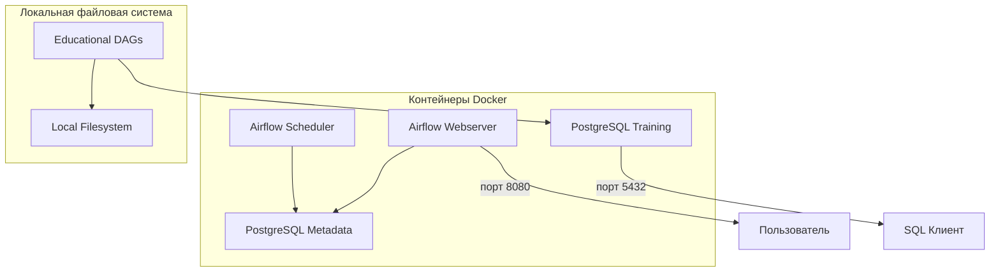

# Educational Airflow Setup for Beginners

Простой учебный стенд Apache Airflow для начинающих, изучающих SQL и Python.

## 🎯 Цель проекта

Создать максимально простую среду для изучения Apache Airflow, где все переменные окружения захардкожены для удобства студентов.

## 📋 Предварительные требования

- Docker и Docker Compose
- Базовые знания Python и SQL
- Веб-браузер для доступа к интерфейсу Airflow

## 🚀 Быстрый старт

### 1. Клонирование и настройка

```bash
# Перейдите в директорию проекта
cd airflow-docker

# Создайте необходимые директории
mkdir -p dags data/input data/output logs
```

### 2. Запуск стенда

```bash
# Запустите все сервисы
docker-compose up -d
```

### 3. Доступ к интерфейсам

- **Airflow UI**: http://localhost:8080
  - Логин: `admin`
  - Пароль: `admin`

- **PostgreSQL для тренировок**: `localhost:5432`
  - База данных: `training`
  - Пользователь: `student`
  - Пароль: `student`

- **PostgreSQL для метаданных Airflow**: `localhost:5434`
  - База данных: `airflow`
  - Пользователь: `airflow`
  - Пароль: `airflow`

## 🏗️ Архитектура стенда



## 📁 Структура проекта

```
airflow-docker/
├── docker-compose.yml          # Конфигурация Docker
├── .env                        # Переменные окружения (создается автоматически)
├── dags/                       # DAG файлы для обучения
│   ├── hello_world_dag.py      # Базовый пример
│   ├── sql_basic_dag.py       # Работа с SQL
│   ├── file_operations_dag.py # Обработка файлов
│   └── data_processing_dag.py # ETL пайплайн
├── data/                       # Данные для упражнений
│   ├── input/                  # Входные данные
│   └── output/                 # Результаты обработки
├── logs/                       # Логи Airflow
└── README.md                   # Эта инструкция
```

## 🎓 Учебные материалы

### Неделя 1: Основы Airflow

**Цели:**
- Понимание структуры DAG
- Создание простых задач
- Настройка зависимостей между задачами

**Примеры DAG:**
- `hello_world_dag.py` - базовые операторы Python
- `sql_basic_dag.py` - работа с базами данных

### Неделя 2: Интеграция с данными

**Цели:**
- Подключение к PostgreSQL
- Выполнение SQL запросов
- Обработка файлов CSV

**Примеры DAG:**
- `file_operations_dag.py` - работа с файлами
- `data_processing_dag.py` - ETL процессы

### Неделя 3: Продвинутые возможности

**Цели:**
- Условное выполнение задач
- Обработка ошибок
- Параметризация workflows

**Примеры DAG:**
- `branching_dag.py` - условная логика
- `error_handling_dag.py` - обработка ошибок

## 🔧 Технические детали

### Переменные окружения

Все переменные захардкожены для простоты:

```env
# Airflow
AIRFLOW_USER=admin
AIRFLOW_PASSWORD=admin

# PostgreSQL для метаданных Airflow
POSTGRES_USER=airflow
POSTGRES_PASSWORD=airflow
POSTGRES_DB=airflow

# PostgreSQL для учебных упражнений
POSTGRES_USER=student
POSTGRES_PASSWORD=student
POSTGRES_DB=training
```

### Порты

- `8080` - Airflow Webserver
- `5432` - PostgreSQL для тренировок
- `5433` - PostgreSQL для метаданных Airflow

## 🛠️ Управление стендом

### Запуск сервисов
```bash
docker-compose up -d
```

### Остановка сервисов
```bash
docker-compose down
```

### Просмотр логов
```bash
# Логи Airflow
docker-compose logs airflow-webserver
docker-compose logs airflow-scheduler

# Логи PostgreSQL
docker-compose logs postgres-training
docker-compose logs postgres-metadata
```

### Перезапуск конкретного сервиса
```bash
docker-compose restart airflow-webserver
```

## 🐛 Решение проблем

### DAG не появляется в интерфейсе
- Проверьте, что файл находится в папке `dags/`
- Убедитесь в правильности синтаксиса Python
- Проверьте логи планировщика: `docker-compose logs airflow-scheduler`

### Ошибки подключения к базе данных
- Убедитесь, что PostgreSQL запущен: `docker-compose ps`
- Проверьте логи PostgreSQL: `docker-compose logs postgres-training`

### Задачи завершаются с ошибкой
- Проверьте логи задачи в интерфейсе Airflow
- Убедитесь в наличии необходимых Python пакетов

## 📚 Дополнительные ресурсы

- [Официальная документация Airflow](https://airflow.apache.org/docs/)
- [Учебные материалы в родительской папке](../)

## 👥 Для преподавателей

### Добавление новых DAG
1. Создайте файл Python в папке `dags/`
2. Убедитесь в правильности структуры DAG
3. Файл автоматически появится в интерфейсе Airflow

### Изменение конфигурации
Все настройки находятся в `docker-compose.yml` и захардкожены для простоты использования.

### Расширение функциональности
Для добавления новых сервисов или изменения конфигурации отредактируйте `docker-compose.yml`.

---

**Примечание**: Этот стенд предназначен исключительно для учебных целей. Для production использования требуется дополнительная настройка безопасности.
